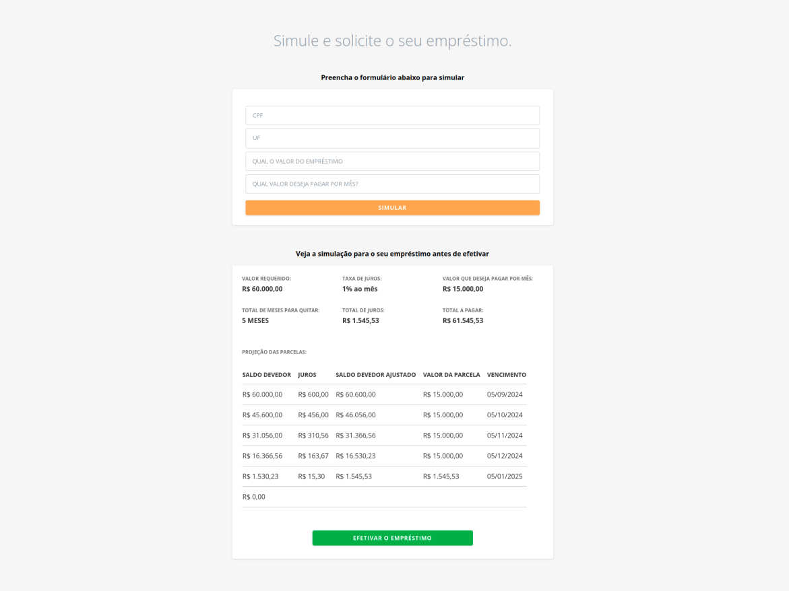

# Simulador de Empréstimo

Este projeto é uma aplicação frontend de simulador de empréstimo construída com Next.js, TypeScript e Tailwind CSS. Ele permite aos usuários criar uma simulação, visualizar os resultados da simulação e solicitar um empréstimo.



## Funcionalidades

- **Simulação de Empréstimo:** Usuários podem inserir seus dados e simular diferentes cenários de empréstimo.
- **Resultados da Simulação:** Visualize os resultados detalhados da simulação do empréstimo, incluindo cronogramas de pagamento e taxas de juros.
- **Solicitar Empréstimo:** Após a simulação, os usuários podem prosseguir para solicitar um empréstimo.

## Estrutura do Projeto

- `src/`: Diretório principal do código fonte.
  - `components/`: Componentes React reutilizáveis.
    - `ui/`: Componentes comuns entre páginas.
    - `loan/`: Componentes específicos do empréstimo.
    - `simulation/`: Componentes específicos da simulação.
  - `app/`: Páginas da aplicação.
  - `contexts/`: Contextos React para compartilhar estados entre componentes.
  - `utils/`: Utilitários e funções auxiliares.

## Como Baixar e Configurar

1. **Clone o Repositório:**

Primeiro, clone o repositório do frontend:

```bash
  git clone https://github.com/gabrielkunst/loan-simulator-frontend.git
```

2. **Instale as Dependências:**

Navegue para o diretório do projeto e instale as dependências:

```bash
  cd loan-simulator-frontend
```

3. **Configure o Backend:**

O backend está em um repositório separado. Clone o repositório do backend:

```bash
  git clone https://github.com/gabrielkunst/loan-simulator-back.git
```

Siga as instruções de instalação no repositório do backend para configurar e rodar o servidor.

4. **Execute a Aplicação:**

Após configurar o backend, volte para o diretório do frontend e inicie o servidor de desenvolvimento:

```bash
  npm run dev
```

5. **Acesse a Aplicação:**

A aplicação estará disponível em `http://localhost:3000`.

Certifique-se de que o backend está rodando para que a aplicação frontend funcione corretamente.
